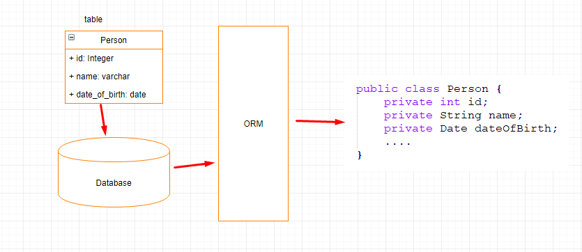
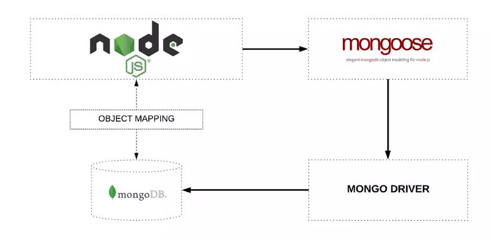
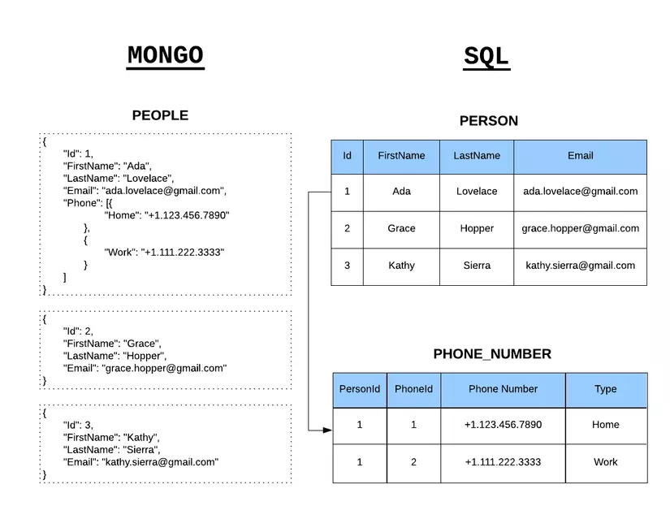

# backend-mongodb

# Table of Contents

- [Schema](#schema)

- [CRUD](#crud)

- [Polulate](#populate)

- [ORM VS Driver](#orm-vs-driver)

## Modeling

- [Design Relationship](#design-relationship)

- [NoSQL vs SQL](#nosql-vs-sql)

- [Index ? Aggregation](#)

## [Reference](https://university.mongodb.com/)

## Schema

For create a  object to match a colecction in database at mongodb

Schema Type:

- String: lowercase,uppercase,trim,match,enum,
- Number: min, max,
- Date: date.now(),
- Buffer:To declare a path as a Buffer, you may use either the Buffer global constructor or the string 'Buffer'.

    ```js
    const file1 = new Data({ binData: 'test'}); // {"type":"Buffer","data":[116,101,115,116]}
    const file2 = new Data({ binData: 72987 }); // {"type":"Buffer","data":[27]}
    const file4 = new Data({ binData: { type: 'Buffer', data: [1, 2, 3]}}); // {"type":"Buffer","data":[1,2,3]}
    ```

- Boolean: True ,false
- Mixed: can define a mixed path using Schema.Types.Mixed or by passing an empty object literal.
- Objectid
- Array:  ten:[String]
- Decimal128
- Map: maps are how you create a nested document with arbitrary keys.

    ```js
    exmaple for map:
    const userSchema = new Schema({.
        socialMediaHandles: {
        type: Map,of: String
        }
    });
    
    const User = mongoose.model('User', userSchema);
    // Map { 'github' => 'vkarpov15', 'twitter' => '@code_barbarian' }
    console.log(new User({
        socialMediaHandles: {
        github: 'vkarpov15',
        twitter: '@code_barbarian',
        }
    }).socialMediaHandles);
    ```

    Note : To use Schema  we need tranfer to model

Create new Model with information at Schema.Can skip some value.

```js
    new User({
        Ten :'Le Minh Hieu',
        Ngaytao: 1999-06-15,
    })

    // in colection is
        // Ten :'Le Minh Hieu',
        // Ngaytao: Date.now(),
        // Tuoi :20
```

## All Schema type

- **${\color{orange}require}$**  : (boolean or function), if true adds a required validator  for this property
- **${\color{orange}default}$** : sets a default value for the path. If the value is a function, the return value of the function is used as the default.
- **${\color{orange}select}$**: boolean, specifies default projections for queries
- **${\color{orange}validate}$**: adds a validator function
- **${\color{orange}get}$** :function, defines a custom getter for this property using Object.defineProperty().
- **${\color{orange}set}$** : same get
- **${\color{orange}alias}$**:
- **${\color{orange}immutble}$**:
- **${\color{orange}transform}$** :

 ```js
    const numberSchema = new Schema({
    integerOnly: {
        type: Number,
        get: v => Math.round(v),
        set: v => Math.round(v),
        alias: 'i'
    }
    });

    const Number = mongoose.model('Number', numberSchema);

    const doc = new Number();
    doc.integerOnly = 2.001;
    doc.integerOnly; // 2
    doc.i; // 2
    doc.i = 3.001;
    doc.integerOnly; // 3
    doc.i; // 3
 ```

[back to top](#backend-mongodb)

## CRUD

(Create,Read,Update,Delete)

1. Create Operations
    Create or insert operations add new documents to a collection. If the collection does not currently exist, insert operations will create the collection.  
    - insertOne
    - inserMany

    ```js
    //inserMany
        db.users.inserOne({
        name:"sue",
        age:26,
        status :"pending"
    })
    ```

2. Read Operations

    Read operations retrieve documents from a collection; i.e. query a collection for documents

    ```js
    db.users.find(
        {age:{$gt:18}},
        {name:1,address:1}
    ).limit(5)
    ```

3. Update Operations

    Update operations modify existing documents in a collection.
    - updateOne()
    - updateMany()
    - replaceOne()

    ```js
     db.users.updateMany(
        {agr:{$lt:18}},
        {$set:{status :"reject"}}
     )
    ```

4. Delete Operations

    Delete operations remove documents from a collection.

    - deleteeOne()
    - deleteMany()

    ```js
    db.users.deleteMany({
        {stauts:"rejetct"}
    })
  
    ```

5. Find

    - **findONe**
    - **findONeAndDelete**: deletes the first matching document in the collection that matches the filter.
    - **findONeAndRemove**
    - **findONeAndReplcae**
    - **findONeAndUpdate**

[back to top](#backend-mongodb)

## Populate

Population is the process of automatically replacing the specified paths in the document with document(s) from other collection(s)

```js
    Story.
  findOne({ title: 'Casino Royale' }).
  populate('author').
  exec(function (err, story) {
    if (err) return handleError(err);
    console.log(story);
  });
```

Mongoose populate doesn't behave like conventional SQL joins. When there's no document, story.author will be null

```js
    await Person.deleteMany({ name: 'Ian Fleming' });

    const story = await Story.findOne({ title: 'Casino Royale' }).populate('author');
    story.author;

```

What if we only want a few specific fields returned for the populated documents

```js
    Story.
    findOne({ title: /casino royale/i }).
    populate('author', 'name'). // only return the Persons name
    exec(function (err, story) {
        if (err) return handleError(err);

        console.log('The author is %s', story.author.name);
        // prints "The author is Ian Fleming"

        console.log('The authors age is %s', story.author.age);
        // prints "The authors age is null"
    });
```

Only the last one will take effect when we want populate multiple paths at the same time

```js
    Story.
    find().
    populate({ path: 'fans', select: 'name' }).
    populate({ path: 'fans', select: 'email' });
    // The above is equivalent to:
    Story.find().populate({ path: 'fans', select: 'email' });
```

We can also add options and queries

```js
Story.
  find().
  populate({
    path: 'fans',
    match: { age: { $gte: 21 } },
    // Explicitly exclude `_id`, see http://bit.ly/2aEfTdB
    select: 'name -_id'
  }).
  exec();
```

Populating across multiple levels

```js
    User.
    findOne({ name: 'Val' }).
    populate({
        path: 'friends',
        // Get friends of friends - populate the 'friends' array for every friend
        populate: { path: 'friends' }
    });
```

Populating multipe database

```js
    const db1 = mongoose.createConnection('mongodb://localhost:27000/db1');
    const db2 = mongoose.createConnection('mongodb://localhost:27001/db2');

    const conversationSchema = new Schema({ numMessages: Number });
    const Conversation = db2.model('Conversation', conversationSchema);

    const eventSchema = new Schema({
    name: String,
    conversation: {
        type: ObjectId,
        ref: Conversation // `ref` is a **Model class**, not a string
    }
    });
    const Event = db1.model('Event', eventSchema);
```

**Dynamic References via `refPath`:**

Mongoose can also populate from multiple collections based on the value of a property in the document 

```js
const commentSchema = new Schema({
  body: { type: String, required: true },
  on: {
    type: Schema.Types.ObjectId,
    required: true,
    refPath: 'onModel'
  },
  onModel: {
    type: String,
    required: true,
    enum: ['BlogPost', 'Product']
  }
});

const Product = mongoose.model('Product', new Schema({ name: String }));
const BlogPost = mongoose.model('BlogPost', new Schema({ title: String }));
const Comment = mongoose.model('Comment', commentSchema);
```

[back to top](#backend-mongodb)
## ORM vs Driver

1. ORM : object relational mapping

    Programming technique for converting data between incompatible type systems using object-oriented programming languages.  

    
    1. Active Record pattern :Eloquent, CachePHP, JOOQ, TOPLINK:
    
        An approach to accessing data in a database. A database table or view is wrapped into a class. Thus, an object instance is tied to a single row in the table. After creation of an object, a new row is added to the table upon save. Any object loaded gets its information from the database. When an object is updated, the corresponding row in the table is also updated. The wrapper class implements accessor methods or properties for each column in the table or view.
        
    2. Data mapper pattern:

        A Data Mapper is a Data Access Layer that performs bidirectional transfer of data between a persistent data store (often a relational database) and an in-memory data representation (the domain layer). The goal of the pattern is to keep the in-memory representation and the persistent data store independent of each other and the data mapper itself.
        
        - Bookshelf.js library
        - TypeORM library
        - Massive.js library
        - Prisma
        - Objection.js library
        - MikroORM library
    3. How does ORM work?

        Encapsulate the database in one object. One part of the object will contain the data, and the other part takes care of how the data is handled and turns it into a relational database.
    
        
    4. Advantages and disadvantages

        - Advantages
            - DRY principle
            - Using MVC model
            - Take advantage of OOP like data inheritance
            - can change or use model anywhere
        - Disadvantages
            - Each framework for each liblary
            - ORM is ***abtracts*** of DB

2. Driver: (ODM - Object Data Model)

    Mongoose is an Object Data Modeling (ODM) library for MongoDB and Node.js. It manages relationships between data, provides schema validation, and is used to translate between objects in code  the representation of those objects in MongoDB.

    

[back to top](#backend-mongodb)

## Design Relationship

1. One to One with embedded documents
    In the normalized data model, the ***address*** document contains a reference to the ***patron*** document.

    ```js
        // andpatron document
        {
        _id: "joe",
        name: "Joe Bookreader"
        }

        // address document
        {
        patron_id: "joe", // reference to patron document
        street: "123 Fake Street",
        city: "Faketon",
        state: "MA",
        zip: "12345"
        }
    ```

    If the address dât í frequently retrieved with name information, we can embed the adderss dat in the patron data

    ```js
        {
        _id: "joe",
        name: "Joe Bookreader",
        address: {
                    street: "123 Fake Street",
                    city: "Faketon",
                    state: "MA",
                    zip: "12345"
                    }
        }
    ```

2. One To many with Embedded documents

    In this one-to-many relationship between patron and address data, the patron has multiple address entities.

    ```js
    {
    "_id": "joe",
    "name": "Joe Bookreader",
    "addresses": [
                    {
                    "street": "123 Fake Street",
                    "city": "Faketon",
                    "state": "MA",
                    "zip": "12345"
                    },
                    {
                    "street": "1 Some Other Street",
                    "city": "Boston",
                    "state": "MA",
                    "zip": "12345"
                    }
                ]
    }
    ```

3. One to Many with Document references

    This page describes a data model that uses references between documents to describe one-to-many relationships between connected data.

    ```js
    {
    title: "MongoDB: The Definitive Guide",
    publisher: {
                name: "O'Reilly Media",
                }
    }

    {
    title: "50 Tips and Tricks for MongoDB Developer",
    publisher: {
                name: "O'Reilly Media",
                }
    }
    ```

    ```js
    {
    name: "O'Reilly Media",
    books: [123456789, 234567890, ...]
    }

    {
        _id: 123456789,
        title: "MongoDB: The Definitive Guide",
    }

    {
    _id: 234567890,
    title: "50 Tips and Tricks for MongoDB Developer",
    }
    ```

4. Subset pattern

    A potential problem with the embedded document pattern is that it can lead to large documents, especially if the embedded field is unbounded. In this case, you can use the subset pattern to only access data which is required by the application, instead of the entire set of embedded data.

    ```js
    {
    "_id": 1,
    "name": "Super Widget",
    "description": "This is the most useful item in your toolbox.",
    "price": { "value": NumberDecimal("119.99"), "currency": "USD" },
    "reviews": [
        {
        "review_id": 786,
        "review_author": "Kristina",
        "review_text": "This is indeed an amazing widget.",
        "published_date": ISODate("2019-02-18")
        },
        {
        "review_id": 785,
        "review_author": "Trina",
        "review_text": "Nice product. Slow shipping.",
        "published_date": ISODate("2019-02-17")
        },
        ...
        {
        "review_id": 1,
        "review_author": "Hans",
        "review_text": "Meh, it's okay.",
        "published_date": ISODate("2017-12-06")
        }
    ]
    }
    ```

[back to top](#backend-mongodb)

## NoSQL vs SQL

 

 1. NoSQL
    - For Big data
    - Non relational
    - Dynamic schemas for unstrutured data
    - Horizonlly scalable
    - Document,key-value,graph or wide-colum stores
    - Better for unstructured data like document or JSON

 2. SQL
    - Relational
    - Vertically scalable
    - Table-based
    - Better for multi-row transactions
 3. When to use?

    For SQL:
     - Simplest to communicate with RDBMS
     - Store and retrieve data from the database quickly
     - Create a custom dashboard
     - Preferably when using joins and performing complex queries
    For NoSQL:
     - Big data
     - No need ACID
     - Dynamic schemas
     - Temporary data storage
     - Data growing  and update continuous

[back to top](#backend-mongodb)

## Indexes and Aggregation

1. Indexes
    1. single index
        We can  create our own category on a field of the document
         - createIndex(): 1 for ascending order, -1 descending order

              >db.records.createIndex( { score: 1 } )

         - Show: using getIndexes()()

              ```js
                  db.mycoll.getIndexes()
                  //reuturn
                  [{
                      "v" : 2,
                      "key" : {
                          "country" : 1
                      },
                      "name" : "country"
                      }
                  ]

              ```

    2. Compound index
 
        Create multipefield of document, it's compound index
        >db.user.createIndex({ email: 1, userName:-1}

    3. Multikey index

        Multikey index to index the content stored in the array
        >db.user.createIndex( {"addr.zip":1}
2. Aggregation 
   
   It is framework run step by step

   1. PipeLine: «Array» aggregation pipeline as an array of objects
   
   2. Model: «Model» the model to use with this aggregate
    Some basic Operations in Aggregation :
    - $project :specify the desired fields to query
    - $match : chose document
    - $limit: limit the number document
    - $skip : skip a document
    - $group: group documents according to certain conditions
    - $sort:arrange documents
    - $unwind : expands on an array, creating an output document for each value in that array
    - $out : writes the result after execution on the pipeline to a collection.

[back to top](#backend-mongodb)